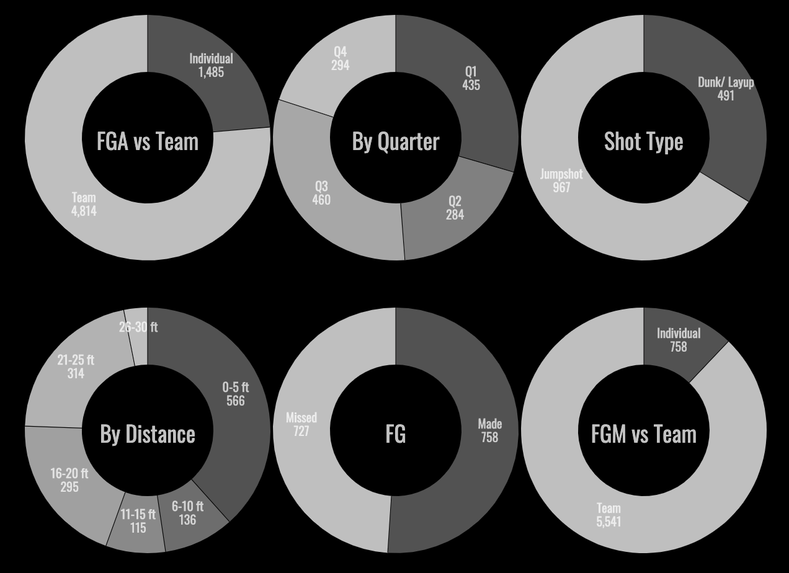

# NBAShotTracker

[View Live Site Here](https://ebaek.github.io/NBAShotTracker/)
---


## Background and Overview
  ### Motivation: 
  * As an avid NBA fan, I wanted to create a tool to enable other fans to see the shot performance of their   
  favorite players. While the NBA stats website has a plethora of data that includes several variations of the shot chart, 
  the goal of creating NBA Shot Tracker was to enable users to see the shot performance of individual players 
  by game. 
  ### High Level Overview: 
  * The NBA Shot Tracker renders an individual player's shot performance. Users can 
  filter the data by game (game date), quarter, and defending team from the 2010-2017 seasons. Users can also 
  compare the indivial player's performance against various metrics including (field goal attempts v.s. team (FGA), field 
  goals made v.s. team (FGM), distance, shot- type, and more.
  
## Architecture and Technologies
  * Vanilla Javascript for overall structure and create an interactive menu 
  * D3 library (d3-hex) to render basketball court and shots taken
  * R to sort the csv files 
  * Webpack to bundle scripts into a single source

## MVP Features
  ### Basketball Court: 
  * I used D3 to plot the basketball court chart, which reflects the dimensions of an NBA court from the division line 
  (backboard, rim, 3- point arc, baseline).
  
  ### Shots: 
  * I used hexagonal binning (d3-hexbin) to reflect the shots taken with red representing shots missed and blue representing 
  shots made. Because shot coordinates often overlap, hexagonal binning is an excellent way to display density (the more  
  saturated colors indicate an increased number of shots taken). 
  * After finding a dataset, the next step was to contextualize the x, y coordinates, which didn't have any indication of 
  unit. After plotting a few hundred points and evalauating the min and max, I realized that the origin was located at the 
  rim, and the units represented 1/10 of a foot. 
  * The following is a plot of Sixers' Ben Simmons shot performance from the 2017-2018 season, which shows that he has a lot 
  more work to do around the 3 point line.
  
  
  
  

  
  ### Selectors:
  * Horizontal scroll menu includes a list of all defending teams played in the selected season in chronological order
    * I used R Studio to sort the shots in chronological order (game dates)
  * The team indicator accounts for player trades throughout the NBA season.
  * After selecting a game, users can filter shots by quarter.
  
  

  
  ### Search Bar: 
  * Search bar includes all NBA players in the 2010-2018 season.
  * In order to maximize performance, I wrote a debounce function that delays a database query when a user is searching for a 
  player
  
  ```
  document.addEventListener("DOMContentLoaded", () => {
    const searchfield = document.querySelector("input");

    searchfield.oninput = (event) => {
        event.target.value === "" ? clearPlayerMenuResults() : debounceSearch(event);
    };
  });

  const debounce = (func, delay) => {    
    let timeoutId;

    return (newArgs) => {
        const args = newArgs.target.value;
        clearTimeout(timeoutId);
        timeoutId = setTimeout(() => func(args), delay);
    }
  }
  ```
  
  


  ### Season Shot Breakdown:
  * The season shot breakdown includes 6 metrics: FG, FGA v.s. Team, FGM v.s. Team, Shot Type, Distance, and Quarter as 
  reflected in pie charts.
  * In comparing a player's shot performance against his team, FGA v..s Team and FGM v.s. Team account for trades that result 
  in a player switching teams mid- season. 
  * The following is an example of how I extracted the CSV data for use in my render method: 
  
    ```
      shotActionStats(season) {
        const that = this;

        d3.csv(`./dataset/${season}.csv`).then(function (data) {
            const shotActionsList = [
                {name: "Dunk/ Layup", value: 0},
                {name: "Jumpshot", value: 0},
            ]

            data.forEach( (shot) => {
                if (shot.name.toLowerCase() === that.playerName.toLowerCase()) {
                    const shotAction = shot.action_type.toLowerCase();

                    if(shotAction.includes("dunk") || shotAction.includes("layup") || shotAction.includes("hook")) {
                        shotActionsList[0].value += 1;
                    } else if (shotAction.includes("jump")) {
                        shotActionsList[1].value += 1;
                    }
                }
            })

            return shotActionsList;
            
        }).then((stats) => { this.render(stats, "Shot Type"); });
    ```
    
   
  
## Wireframe

  
## Dataset 
  * [NBA Savant Shot Tracker 2010 - 2018](https://nbasavant.com/shot_search.php)

## Implementation Timeline
  * Day 1: Render the chart using D3
  * Day 2: Plot the shots using D3-hex
  * Day 3: Add selectors for game, team played against
  * Day 4: Add selectors and animate the shots 
  * Day 5: Build webscraper 
